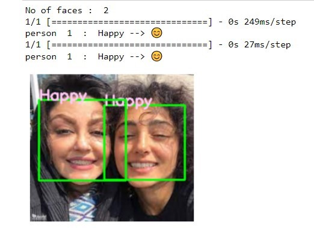
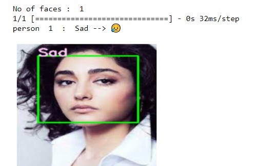

# Facial Emotion Recognition using CNN :

This is a completely deep learning project that is completely based on neural networks, and it can be said that the Facial Emotion Recognition (FER) project is one of the classic projects in deep learning.
 
 
During this project, we implement a human emotion recognition system from facial images using Convolutional Neural Networks (CNN). The main goal of this project is to identify 7 categories of different emotions, including anger, disgust, fear, happiness, sadness, surprise, and neutral..
 
  
 

   
Here I trained the convolution neural network with kaggle facial emotion dataset. so that it learns patterns for each facial expression and able to detect facial emotions
   

The picture below shows the distribution of labels for each emotion for the real test labels and the labels predicted by the model.
 
 
 --
 

-------

-----
_Feel free to download, clone , fork the project._  

## Installation of python libraries:
  * keras with tensorflow as backend
  * OpenCV
  * numpy
  * pandas
  * matplotlib

## DataSet:
In this project I used kaggle dataset i.e   
  https://www.kaggle.com/c/challenges-in-representation-learning-facial-expression-recognition-challenge/overview
   
    we can use a kaggle API to access and download that dataset.

## Usage:
 
 
In the notebook, I  explain all the concepts, pipeline , terminology , functions which is involved in the program in a clear and concised manner. 
Even I also mention some of my insights , intuitions and observations in the project. 
I document almost everything  that is used in the  program. 
This notebook file is a complete wrapout  of practical exposure, understanding and theory.
 
 

  * facial_Emotion_Recognition_using_cnn.ipnb -->  main file
  * images folder --> consists of images to be tested and also contains screenshots of results of that images.
  * model.h5 --> saved weights of the model which is trained with 200 epochs
  * model_architecture.json --> saved architecture of the neural network.
  * haarcascade classifiers --> higly pretrained classifiers to detect faces.
 
 
The following is the results of the images. I also add the number of persons in the image and the relevant emojis to their emotions of the persons to create sense of feel.
  

In the image provided below, you can see the distribution of different emotions predicted by the model for a random image

  
  
And below are some images and model predictions
 --

   
   
  Thanks, Hope you enjoy the project! :)
   
   
   
  

  ## Contributing:
  all pull requests are welcome. I felt glad if you give me any suggestions. :)))

   
   

  
  --------
## Contact:
     
  
